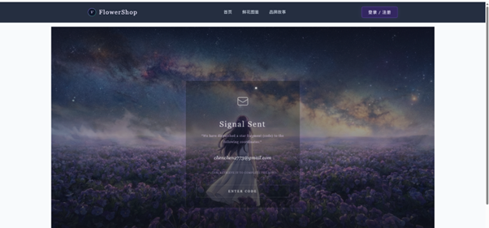
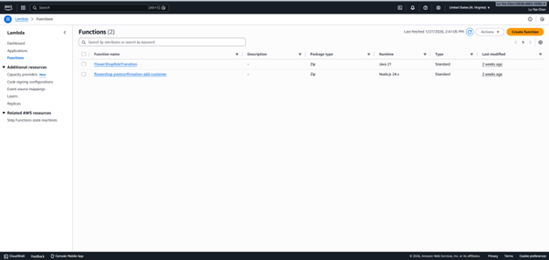
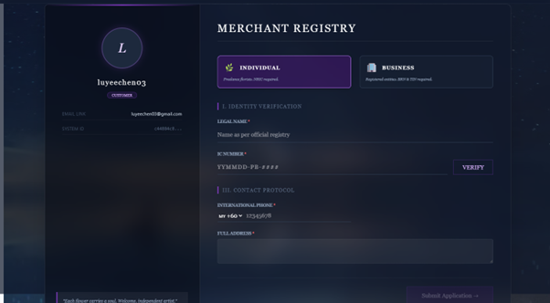
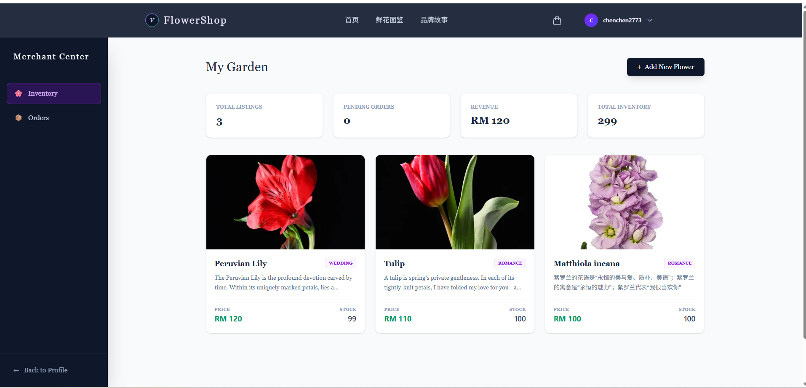
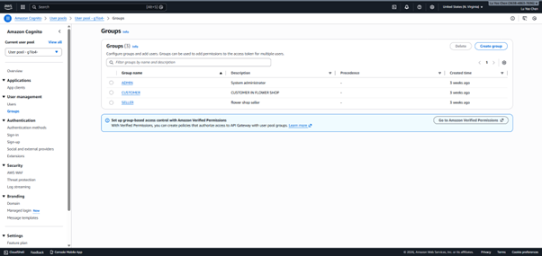

# Flora-Ecom - Hybrid Cloud E-Commerce Platform


> **A full-stack e-commerce solution demonstrating Enterprise Hybrid Cloud Architecture.**
> Integrating a Spring Boot Monolith (EC2) for core transactional logic with AWS Serverless (Lambda) for edge computing and identity management.

## 🔗 Live Demo
* **Frontend:** (https://flora-ecom-frontend-4vitn8zch-luyeechen1s-projects.vercel.app/)
* **Backend:** Hosted on AWS (Hybrid EC2 + Lambda)

---

## ⚡ Quick Look: Architecture Decisions

| Component | Technology | Hosting | Rationale |
| :--- | :--- | :--- | :--- |
| **Core Business** | Java Spring Boot | **AWS EC2** | Handling complex transactions (Orders, Inventory) requiring strong ACID compliance. |
| **Identity & Auth** | AWS Cognito | **Managed** | Secure SRP protocol; offloading credential storage risks. |
| **Ops Triggers** | Node.js / Java | **AWS Lambda** | Event-driven tasks (e.g., Auto-assigning roles, Role Transitions) run only when needed. |
| **Frontend** | Vue 3 + TS | **Vercel** | Static asset distribution via Global CDN. |

---

## 🚀 Key Highlights

### 1. 🌌 The "Star-Bond" Event-Driven Auth
A custom, immersive registration flow using **Event-Driven Architecture**.
* **User Action:** Enters email -> **System:** Triggers Cognito -> **Lambda:** Auto-injects "Customer" Role -> **UI:** "Bond Established".

| Signal Sent (OTP) | Bond Established | Infrastructure Logic |
| :---: | :---: | :---: |
|  |  |  |

### 2. ⚡ Instant Seller Onboarding (KYC Flow)
Designed for seamless growth, the platform features an **Automated Role Transition** system.
* **Flow:** User fills KYC Data (ID/Tax Info) -> **System:** Validates Data -> **Instant Promotion** to `SELLER` role.
* **Control:** Admins retain oversight capabilities to manually deactivate accounts via the AWS Console if compliance issues arise.

| Merchant Application | Contract Sealed | Seller Dashboard |
| :---: | :---: | :---: |
|  |  |  |

### 3. 🔐 Enterprise RBAC (Role-Based Access Control)
Strict security implementation using **AWS Cognito Groups**.
* **ADMIN:** System oversight & User Deactivation.
* **SELLER:** Product management & Order fulfillment.
* **CUSTOMER:** Shopping & Order tracking.



---

## 🛠️ Technical Stack

* **Frontend:** Vue 3 (Script Setup), TypeScript, Tailwind CSS, Pinia.
* **Backend:** Java 21, Spring Boot 3, Maven.
* **Database:** MySQL 8.0 (AWS RDS).
* **Cloud Services:** AWS EC2, Lambda (Node.js/Java), S3, Cognito, API Gateway.

---

## 📂 Project Structure (Clean Architecture)

Both repositories adhere to strict **Clean Architecture** principles to decouple business logic from frameworks.

### 🟢 Frontend: `Flora-Ecom-Frontend`
Structure based on Domain-Driven Design (DDD).

```text
src/
├── 🔵 domain/            # Pure Business Logic
│   ├── interfaces/       # Entity & Service Interfaces
│   ├── models/           # Data Models
│   └── use-cases/        # Application Business Rules
│
├── 🟠 infrastructure/    # External Implementations
│   ├── api/              # Axios Clients
│   └── repositories/     # Data Fetching Implementations
│
└── 🟢 presentation/      # UI Layer
    ├── components/       # Reusable UI Elements
    ├── router/           # Navigation
    ├── store/            # Pinia State Management
    └── views/            # Page Layouts

```

### 🔵 Backend: `Flora-Ecom-Backend`

Layered architecture separating Application, Domain, and Infrastructure.

```text
src/main/java/com/backend/flowershop/
├── 🟤 application/       # Service Orchestration
│   ├── dto/              # Data Transfer Objects
│   ├── port/             # Input/Output Ports
│   └── service/          # Business Logic Implementations
│
├── 🔵 domain/            # Core Entities
│   ├── enums/            # Business Constants
│   ├── model/            # JPA Entities
│   └── repository/       # Repository Interfaces
│
└── 🟠 infrastructure/    # Framework Adapters
    ├── external/aws/     # AWS SDK Integrations
    ├── persistence/      # Spring Data JPA
    ├── security/         # Spring Security Config
    └── web/              # REST Controllers

```

---

## 🔧 Installation & Setup

### Prerequisites

* Java JDK 21
* Node.js v18+
* MySQL Server

### 1. Frontend Setup

```bash
# Clone the frontend repository
git clone [https://github.com/LuYeeChen1/Flora-Ecom-Frontend.git](https://github.com/LuYeeChen1/Flora-Ecom-Frontend.git)
cd Flora-Ecom-Frontend

# Install dependencies
npm install

# Configure .env with your backend URL
npm run dev

```

### 2. Backend Setup

```bash
# Clone the backend repository
git clone [https://github.com/LuYeeChen1/Flora-Ecom-Backend.git](https://github.com/LuYeeChen1/Flora-Ecom-Backend.git)
cd Flora-Ecom-Backend

# Update application.properties with AWS/DB credentials
# Build and Run
mvn clean install
java -jar target/flower-shop.jar

```

---

## 👨‍💻 Author

**Lu Yee Chen**

* **Role:** Full Stack Cloud Developer
* **GitHub:** [@LuYeeChen1](https://www.google.com/search?q=https://github.com/LuYeeChen1)
* **Email:** luyeechen03@gmail.com
